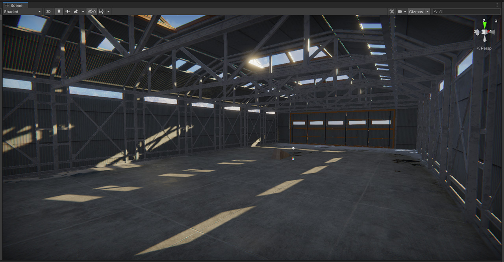

# BMX The Game: Custom Park Template

> ⚠ This project and its documentation are still in development ⚠

We have set up this project to give you an easy tool to make your own park for our game BMX The Game.

You can use your favorite 3D app (like Blender, 3dsmax, Sketchup...) to design your park. If you don't have specific knowledge of any 3D app you also can use   [ProBuilder](https://www.youtube.com/watch?v=YtzIXCKr8Wo) which is already set up inside the project. You can also set up the scene lighting and the environment. Use your own textures and any external 3d asset if you want.

The project is ready to export a custom park in Unity and then test it on BMX The Game 0.9.0.7 or later.

## You will need
  - [BMX The Game 0.9.0.7](https://store.steampowered.com/app/987150/BMX_The_Game/) (check the Beta branch on Steam in order to unlock it)
  - [Unity 2019.4.24f1](https://unity3d.com/get-unity/download?thank-you=update&download_nid=64645&os=Win)

## How to use
  - Download the GitHub and open it in Unity
  - Once in the Unity project, there's a scene called "Custom Park" which is the scene to edit
  - Import any asset that you want and build up your park and the environment
  - Set up the colliders for the objects
  - Import the textures and set up the materials
  - Set up any rideable object in the scene to the layer "DynamicProps"
  - Move the object "CustomSessionMarkSpawn" to the spawn desired point
  - Set up the light, skybox and reflection probes
  - Set up the color grading, contained in the object >Light>Color
  - Disable the object called "_DISABLE THIS BEFORE EXPORT!!!"
  - Click on the menu Tools>ModTool>Export Mod
  - Fill out the form, select an output directory, and "Export Mod"
  - Copy the result folder into the parks folder, located in the BMX The Game install folder
  - Play it on BMX The Game

This feature is currently in progress so is expected to be improved soon. Don't hesitate to give us feedback on this feature. 

## Limitations
The game it just can load just one park from the folder, so you have to manage the parks installed manually. At this point, scripts and code can't be exported.

## WIP
We would like to improve this feature. Here's a list of things that we are working on:
  - Managing more than one custom park inside the game
  - Cloud storage of the parks to simplify the sharing

## License
Our intention is that you can use this project as a starting point for your own custom parks. For the legal words, see
[LICENSE.md](LICENSE.md).
